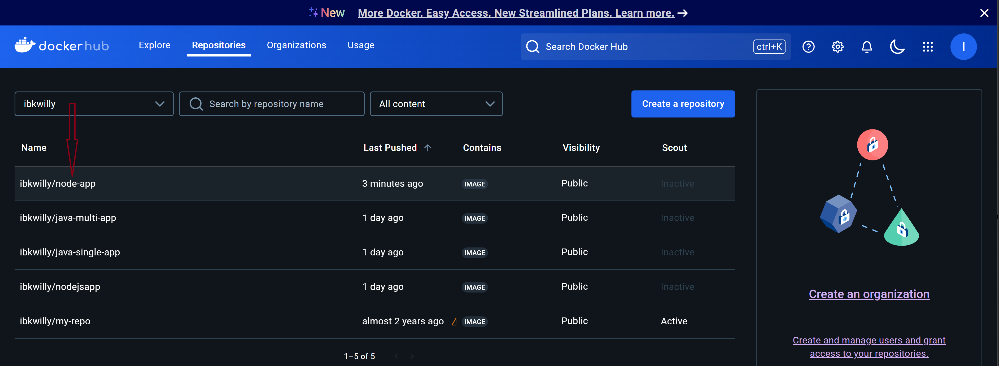
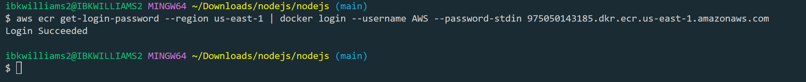

## Dockerizing a Node.js, Java, and Go Application with Best Practices
This task involves packaging Node.js, Java, and Go applications into Docker containers. It will cover single-stage and multi-stage builds and demonstrate best practices for creating efficient, secure, and optimized Docker images. Finally, the images will be pushed to Docker Hub and AWS ECR.
### General Prerequisites
##### 1. Basic Knowledge

Familiarity with Docker concepts (e.g., images, containers, Dockerfile).
Basic understanding of the programming languages: Node.js, Java, and Go.
##### 2. Environment Setup

- Docker Installed: Ensure Docker is installed on your machine.
Download Docker if not already installed.
- AWS CLI Installed: For pushing images to AWS ECR, install and configure the AWS Command Line Interface.
AWS CLI Installation Guide.
- Programming Language Tools:
  -  **Node.js**: Install Node.js and npm for the Node.js application.
  -  **Java**: Install JDK and Maven for the Java application.
  -  **Go**: Install Go for the Go application.

##### 3. Docker Hub Account

-   Sign up for a free Docker Hub account to push your images.
Docker Hub Signup.
#####   4. AWS Account

-   Create an AWS account to push images to AWS Elastic Container Registry (ECR).
AWS Signup.
### Specific Prerequisites for Each Application

##### 1. Node.js Application
-   Project Setup: A Node.js project with a valid ```package.json``` file.
Run the following command to initialize:
    ```bash
    npm init -y
    ```
-   Dependencies Installed: Install dependencies locally to test the application before containerizing.
Example for Express app:
    ```bash
    npm install express
    ```
##### 2. Java Application
-   Maven or Gradle Installed: Install a build tool like Maven or Gradle for managing dependencies and building .jar files.
-   Java Build Tools Configuration: Ensure your pom.xml (for Maven) or build.gradle (for Gradle) is correctly set up.
##### 3. Go Application
-   Go Modules Enabled: Initialize Go modules in your project directory:
    ```bash
    go mod init your-module-name
    ```
-   Test Locally: Ensure the application compiles and runs locally
    ```bash
    go build
    ./your-app
    ```
### Infrastructure Prerequisites
1. AWS ECR Setup
-   ECR Repository Created: Create a repository in AWS ECR for each application:
    ```bash
    aws ecr create-repository --repository-name <repository-name>
    ```
2. AWS CLI Configuration
Configure the AWS CLI with credentials:
    ```bash
    aws configure
    ```
   ##### You'll need:
-   AWS Access Key ID
-   AWS Secret Access Key
-   Default region (e.g., us-east-1).
**step-by-step guide** to dockerizing a Node.js application and deploying it on an AWS Ubuntu instance:

---

### **1. Prepare the AWS Ubuntu Instance**

#### **Step 1.1: Launch the AWS EC2 Instance**
1. Log in to your AWS Management Console.
2. Navigate to **EC2 Dashboard** and click **Launch Instances**.
3. Configure the instance:
   - **Choose an AMI:** Select an Ubuntu Server (e.g., Ubuntu 22.04 LTS).
   - **Instance Type:** Choose a type, such as `t2.micro` (free tier eligible).
   - **Key Pair:** Create or select an existing key pair for SSH access.
   - **Security Group Rules:**
     - Allow SSH (port 22) from your IP.
     - Allow HTTP (port 80) and any other relevant ports (e.g., 5000 for Node.js).

4. Launch the instance and note its **Public IP** address.

#### **Step 1.2: Connect to the Instance**
Use SSH to connect to your instance:
```bash
ssh -i /path/to/your-key.pem ubuntu@<instance-public-ip>
```


---

### **2. Set Up the Ubuntu Instance**

#### **Step 2.1: Update and Install Dependencies**
Run the following commands to update the system and install necessary tools:
```bash
sudo apt update && sudo apt upgrade -y
```

#### **Step 2.2: Install Docker**
1. Install Docker:
   ```bash
   sudo apt-get install -y docker.io
   ```
2. Start and enable the Docker service:
   ```bash
   sudo systemctl start docker
   sudo systemctl enable docker
   ```
   
3. Verify Docker installation:
   ```bash
   docker --version
   ```
    
#### **Step 2.3: Install Docker Compose (Optional)**
If needed, install Docker Compose:
```bash
sudo curl -L "https://github.com/docker/compose/releases/download/v2.20.2/docker-compose-$(uname -s)-$(uname -m)" -o /usr/local/bin/docker-compose
sudo chmod +x /usr/local/bin/docker-compose
docker-compose --version
```

#### **Step 2.4: Install Node.js and npm**
Install Node.js and npm to test the application locally before containerizing:
```bash
curl -fsSL https://deb.nodesource.com/setup_18.x | sudo -E bash -
sudo apt-get install -y nodejs
node -v
npm -v
```

---

### **3. Prepare the Node.js Application**
1. Create folder containing the application

``cd`` into the application folder and create ```index.js```
Paste the application code into the ```index.js```
```script
// index.js
const http = require('http');

const server = http.createServer((req, res) => {
    res.writeHead(200, {'Content-Type': 'text/plain'});
    res.end('Hello sir, williams node container running!\n');
});

const PORT = 5000;
server.listen(PORT, () => {
    console.log(`Server running on port ${PORT}`);
});
```

2. Start the application locally:
   ```bash
   node index.js
   ```
    
3. Verify it's working by accessing the instance’s public IP and port in a browser:
   ```
   http://<instance-public-ip>:5000
   ```
    
---

### **4. Write the Dockerfile**

Create a `Dockerfile` in the Node.js application root directory:
```Dockerfile
# Use the official Node.js image as the base
FROM node:22-alpine

# Set the working directory
WORKDIR /usr/src/app

# Copy package.json and package-lock.json / copying the json package into the root folder of the container
COPY package*.json ./

# Install dependence
RUN npm ci --only=production


# Copy application code /copying all the source code to the container root directory
COPY . .

# Expose the application port
EXPOSE 5000

# Start the application
CMD ["node", "index.js"]
```

---

### **5. Build and Run the Docker Container**

#### **Step 5.1: Build the Docker Image**
Run the following command in the application directory:
```bash
sudo docker build -t node-app:latest .
```

#### **Step 5.2: Run the Docker Container**
Run the container and map port `5000` of the container to port `5000` on the host:
```bash
sudo docker run -d -p 5000:5000 node-app:latest
```

#### **Step 5.3: Verify the Application**
Open your browser and access:
```
http://<instance-public-ip>:5000
```

---

### **6. Push the Docker Image to Docker Hub**

#### **Step 6.1: Log in to Docker Hub**
Log in using your Docker Hub credentials:
```bash
sudo docker login
```
Enter your Docker Hub username and password when prompted.


#### **Step 6.2: Tag the Docker Image**
Tag the image with your Docker Hub username:
Docker Hub requires images to be tagged with your ```username/repository-name```.

```bash
sudo sudo docker tag node-app:latest your-dockerhub-username/node-app:latest
```


#### **Step 6.3: Push the Image**
Push the image to your Docker Hub repository:
```bash
sudo docker push your-dockerhub-username/node-app:v1.00
```


Your image will now be available on Docker Hub.
Verify the Image on Docker Hub:
Log in to your Docker Hub account via the web interface to ensure the image is uploaded.


---

### **7. Push the Docker Image to AWS ECR**
To Push to Amazon ECR
####  **1.    First, Set Up AWS CLI:**
-   Install and configure the AWS CLI with your credentials:
  Run the following command to download the zipped files of awscli
    ```bash
    curl "https://awscli.amazonaws.com/awscli-exe-linux-x86_64.zip" -o "awscliv2.zip"
    ```
    
    
    TO unzip the awscliv2.zip file; install unzip with the following command
    ```bash
    sudo apt install unzip -y
    ```
    Run the unzip command:
    ```bash
    unzip awscliv2.zip
    ```
    Run the following command to install the awscl
    ```bash
    sudo ./aws/install
    ```
    once you run the above command, you should get:
    
    

    ```bash
    aws configure
    ```
    
-   Provide your AWS access key, secret key, region, and output format from the downloaded access key.csv file
####  **2.    Create an ECR Repository:**
Follow the instructions for creating an ECR repository


```bash
    aws configure
 ```


#### **Step 7.1: Authenticate Docker to AWS ECR**
Get the ECR login command and authenticate:

```bash
aws ecr get-login-password --region us-east-1 | docker login --username AWS --password-stdin 975050143185.dkr.ecr.us-east-1.amazonaws.com
```

#### **Step 7.2: Tag the Docker Image**
Tag the Docker image for your ECR repository:
```bash
docker tag ibkwilliams1:latest 975050143185.dkr.ecr.us-east-1.amazonaws.com/ibkwilliams1:1.0.0
```


#### **Step 7.3: Push the Image to ECR**
Push the image to your ECR repository:
```bash
docker push 975050143185.dkr.ecr.us-east-1.amazonaws.com/ibkwilliams1:1.0.0
```

The image is pushed to the ECR repository


---

### **8. Run the Container from ECR**

1. Pull the image from ECR:
   ```bash
   docker pull 975050143185.dkr.ecr.us-east-1.amazonaws.com/ibkwilliams1:1.0.0
   ```
2. Run the container:
   To run the container in detached mode and expose it at port 3000, you can use the following docker run command:
   ```bash
   docker run -d -p 3000:3000 975050143185.dkr.ecr.us-east-1.amazonaws.com/ibkwilliams1:1.0.0
   ```
### Explanation:
- `-d`: Runs the container in detached mode (in the background).
- `-p 3000:3000`: Maps port `3000` on your local machine to port `3000` inside the container.
- The image `975050143185.dkr.ecr.us-east-1.amazonaws.com/ibkwilliams1:1.0.0` is used to create the container.
Before running this, ensure the image is pulled locally with the `docker pull` command if it isn’t already.
---
### **9. How to apply a lifecycle Policy on ECR Repository**
#####   Step 1: Ensure AWS CLI is Installed and Configured

1. Install the AWS CLI if not already installed:
 ```bash
   curl "https://awscli.amazonaws.com/awscli-exe-linux-x86_64.zip" -o "awscliv2.zip"
unzip awscliv2.zip
sudo ./aws/install
```
(For Windows, use the appropriate installer)

2. Configure AWS CLI with your credentials:
   
```bash
   aws configure
```
Provide your Access Key, Secret Key, Default Region, and Output Format.

---

##### Step 2: Save the Lifecycle Policy File
Save the provided lifecycle policy to a file called lifecycle.json:
```bash
nano lifecycle.json
```
Paste the JSON content into the file and save it.
```json
{
  "rules": [
    {
      "rulePriority": 1,
      "description": "Retain only the 3 most recent tagged images",
      "selection": {
        "tagStatus": "tagged",
        "countType": "imageCountMoreThan",
        "countNumber": 3
      },
      "action": {
        "type": "expire"
      }
    },
    {
      "rulePriority": 2,
      "description": "Delete all untagged images",
      "selection": {
        "tagStatus": "untagged",
        "countType": "imageCountMoreThan",
        "countNumber": 0
      },
      "action": {
        "type": "expire"
      }
    }
  ]
}
```
---

#####   Step 3: Apply the Lifecycle Policy to the ECR Repository
Use the following AWS CLI command to apply the lifecycle policy to your repository:
```bash
aws ecr put-lifecycle-policy \
  --repository-name ibkwilliams1 \
  --lifecycle-policy-text file://lifecycle.json
```
---
##### Step 4: Verify the Lifecycle Policy
Confirm the lifecycle policy has been applied successfully:

```bash
aws ecr get-lifecycle-policy --repository-name ibkwilliams1
```
---
##### Step 5: List Images in the Repository
Check which images are currently stored in your repository:

```bash
aws ecr list-images --repository-name ibkwilliams1
```
---
##### Step 6: Test Expiration
The expiration process runs automatically in the background, but you can manually initiate it for testing purposes using:
```bash
aws ecr start-image-scan --repository-name ibkwilliams1 --image-id imageTag=1.0.0
```
